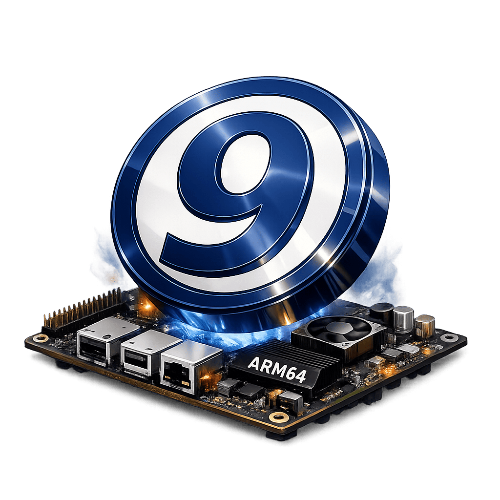

# 9front ARM64 — Orange Pi 4 Pro



Porting [9front](http://9front.org) to the [Orange Pi 4 Pro](http://www.orangepi.org/html/hardWare/computerAndMicrocontrollers/service-and-support/Orange-Pi-4-Pro.html) (Allwinner A733).

## Quick Start

```sh
make help          # show available targets
make kernel        # build kernel (boots QEMU, compiles, extracts)
make sdcard        # build bootable SD card image
```

Flash to SD card:
```sh
sudo dd if=images/orangepi4pro/sdcard.img of=/dev/sdX bs=1M status=progress
```

## Build Targets

| Target | Description |
|--------|-------------|
| `make portdisk` | Pack `port/a733/` into FAT image for QEMU transfer |
| `make kernel` | Build kernel inside 9front QEMU (automated) |
| `make sdcard` | Build bootable SD card image (64MB) |
| `make boot` | Boot 9front QEMU (snapshot mode) |
| `make dev` | Boot QEMU with port disk attached (interactive) |
| `make clean` | Remove build artifacts |

## SD Card Image Layout

| Offset | Content |
|--------|---------|
| 8 KiB | `boot0` — Allwinner SPL (loads U-Boot) |
| 16.8 MiB | `boot_package` — U-Boot + monitor + SCP firmware |
| 32 MiB | FAT32 partition — `9a733.u` (kernel) + `boot.scr` |

## Target Hardware

| | |
|---|---|
| **SoC** | Allwinner A733 (`sun60iw2`) |
| **CPU** | 8-core ARM64 — 4× Cortex-A76 + 4× Cortex-A55 |
| **RAM** | 2/4/8/16 GB LPDDR |
| **Storage** | eMMC, SD, PCIe (NVMe), USB 3.0 |
| **Network** | GbE (Synopsys GMAC), WiFi (AIC8800) |
| **Display** | HDMI, eDP, DSI, LVDS |
| **Console** | UART0 at `0x02500000` (ttyS0, 115200) |

## Port Files

```
port/a733/
├── NOTES.md    # Hardware addresses, design decisions
├── a733        # Kernel config
├── dat.h       # Data structures (from arm64/)
├── fns.h       # Function declarations (from arm64/)
├── io.h        # I/O and interrupt definitions
├── lcd.c       # Display init (WIP — inherits U-Boot framebuffer)
├── mem.h       # Memory map (arm64/ + A733 peripheral addresses)
├── mkfile      # Build rules (references ../arm64/ for shared code)
├── pciaw.c     # PCIe host controller stub
├── screen.c    # Framebuffer console (WIP)
├── screen.h    # Screen declarations
└── uartaw.c    # Allwinner UART driver (8250-compat, MMIO)
```

Shared arm64 code reused from `sys/src/9/arm64/`:
`l.s`, `cache.v8.s`, `clock.c`, `fpu.c`, `gic.c`, `main.c`,
`mem.c`, `mmu.c`, `sysreg.c`, `trap.c`, `bootargs.c`

## Development Workflow

1. Edit files in `port/a733/` on the host
2. `make portdisk` — packs into FAT image
3. `make dev` — boots QEMU with port disk attached
4. Inside 9front:
   ```
   dossrv -f /dev/sdG0/data portdisk
   mount -c /srv/portdisk /n/port
   dircp /n/port/a733 /sys/src/9/a733
   cd /sys/src/9/a733 && mk
   ```
5. Or: `make kernel` to automate steps 2–4 + extract

## Prerequisites

- QEMU (`qemu-system-aarch64`)
- mtools (`mcopy`, `mformat`, `mdir`)
- expect (`expect`)
- mkimage (`u-boot-tools`)
- qemu-user-static (for building vendor U-Boot boot blobs)
- ARM cross-compiler (`gcc-arm-linux-gnueabi`, for vendor U-Boot only)

Pinned hardware bootstrap blobs are kept under `bootstrap/orangepi4pro/`.
Generated outputs stay in `images/<board>/`.

## Peripheral Status

| Peripheral | Driver | Status |
|------------|--------|--------|
| GICv3 | `arm64/gic.c` | ✅ Reused |
| ARM Timer | `arm64/clock.c` | ✅ Reused |
| UART (serial) | `uartaw.c` | ✅ Written |
| PCIe | `pciaw.c` | 🔧 Stub (DesignWare init needed) |
| Framebuffer | `screen.c` + `lcd.c` | 🔧 Written, not yet in config |
| NVMe | `port/sdnvme.c` | ⏳ Needs PCIe |
| USB XHCI | `port/usbxhci.c` | ⏳ Needs testing |
| Ethernet | — | 🆕 Not started (Synopsys GMAC) |
| SD/eMMC | — | 🆕 Not started (Allwinner MMC) |

## Repository Layout Convention

- `vendors/<name>/` — checked-out upstream source trees and submodules
- `bootstrap/<board>/` — checked-in board bootstrap binaries needed for hardware bring-up
- `images/<board>/` — board-specific generated images and emulator/runtime assets
- `port/a733/` — kernel port sources

## Vendor Resources

- **BSP:** [orangepi-xunlong/orangepi-build](https://github.com/orangepi-xunlong/orangepi-build) → local checkout at `vendors/orangepi-build/`
- **U-Boot fork:** `v2018.05-sun60iw2` branch on gitee
- **Board config:** `orangepi4pro.conf` → `sun60iw2` family
- **DTB:** `allwinner/sun60i-a733-orangepi-4-pro.dtb`
